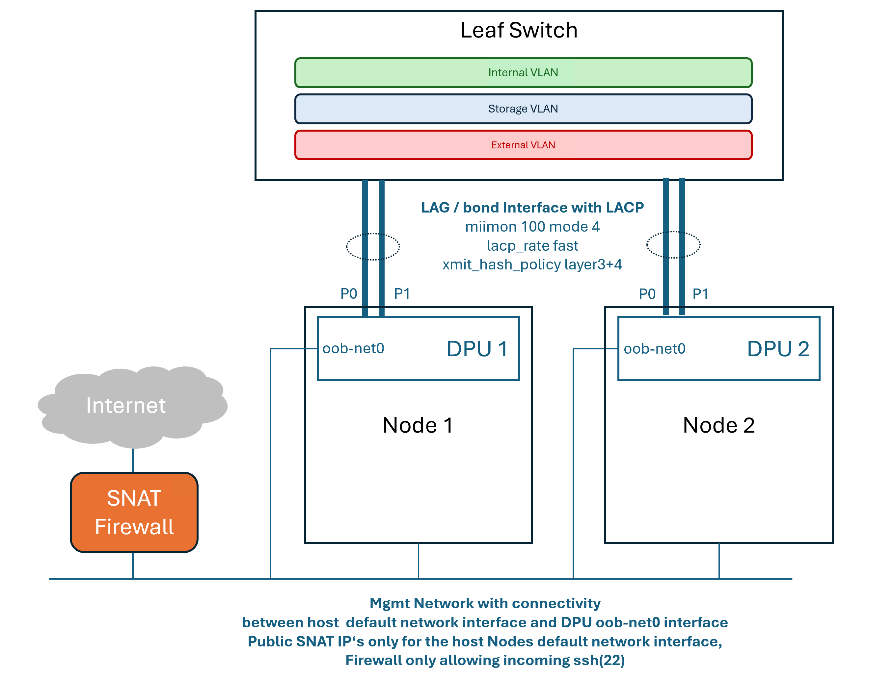

# f5bnk-kubespray

Deploy F5 BNK https://clouddocs.f5.com/bigip-next-for-kubernetes/latest/
on baremetal node
with Nvidia Bluefield-3 using kubespray, connected via LAG to the DC Fabric.



## Requirements

- f5-far-auth-key.tgz (download from myf5.com, place the tgz file in ~/far/ folder)
- JWT Token placed in file ~/.jwt
- docker or podman
- kubectl, helm, yq
- baremetal server with Nvidia Bluefield-3
- NFS server, referenced in resources/storageclass.yaml. Adjust accordingly
- One or two Ethernet switch with LACP based LAG support (MC-LAG or EVPN-MH in case of dual attached nodes to different leafs)
- Set TMM_DEFAULT_MTU in resources/bnkgatewayclass.yaml to match DPU and host network MTU.


Example /etc/exports flags

```
/share/bnk  *(rw,sync,no_subtree_check,no_root_squash)
```

## Deployment

- Create and adjust .env

```
  cp .env.example .env
```


- Deploy via Makefile

```
make
```

## Destroy cluster

```
make clean-all
```

### Caveats

- VLAN host interfaces get removed during the DPU imaging process. Re-apply by running `sudo netplan apply` on the 
host. Script deploy-bf-bundle.sh does it automatically, but worth checking if all interfaces are present on the host.
- High speed interfaces (from DPU) on worker nodes must have provisioned VF's on both physical ports. FLO checks those
prior to deploying into namespace f5-utils

## Resources

- https://clouddocs.f5.com/bigip-next-for-kubernetes/2.0.0-GA/
- https://github.com/kubernetes-sigs/kubespray (source of sample inventory)
- https://github.com/f5devcentral/f5-bnk-nvidia-bf3-installations
- https://docs.nvidia.com/networking/display/bluefielddpuosv460/link+aggregation
